# ReelRouter

> 从创作关键词到可验收镜头视频的长文本分集 AI 视频编排原型。

ReelRouter 不是“输入一句提示词就生成一个视频”的包装器。它把长文本改编拆成可审计的生产链：小说生成、RAG 证据检索、连续分集、候选剧本、Reviewer 审查、人工批准、Provider 感知分镜、成本预检和异步视频任务。

项目遵循一条明确边界：**LLM 负责创作与判断；确定性代码负责契约、状态、成本与执行。**

## v1 已验收能力

```text
关键词
  → 结构化小说
  → MySQL 分块 + BGE-M3 / FAISS 项目知识库
  → 分集计划
  → 候选剧本
  → Reviewer + 人工批准
  → 跨集 EpisodeSummary
  → Provider 感知的优先级分镜
  → 模型路由与整集成本预检
  → 异步视频任务、轮询与人工视频评审
```

- 支持 Text-to-Video / Image-to-Video、Mock、Runway 与火山方舟 Seedance Provider。
- 使用 MySQL 保存叙事资产、候选稿、审核摘要、视频任务与镜头映射；FAISS 仅保存可重建的项目索引。
- 第 2 集必须读取第 1 集经 Reviewer 通过、人工批准后写入的摘要，避免跨集流程绕过。
- 每个 LLM 阶段都使用 Pydantic Schema 校验；格式失败时有限重试，并将字段级错误反馈给调用者。
- 分镜生成会读取当前 Provider 的最短/最长视频时长。例如 Seedance 2.x 下，45 秒单集最多 11 个镜头且每个至少 4 秒，避免生成后才发现无法提交。
- 视频执行前计算整集总成本；真实视频提交和 FFmpeg 合成均要求显式人工确认。

## 架构图

完整说明见 [docs/architecture.md](docs/architecture.md)。

```mermaid
flowchart LR
    U[用户 / Vue 3 工作台] --> API[FastAPI]
    API --> N[Narrative Harness]
    N --> SW[Story Writer]
    SW --> KB[(MySQL 原文与分块)]
    KB <--> RAG[BGE-M3 + FAISS]
    RAG --> EP[Episode Planner]
    EP --> SC[Screenwriter]
    SC --> RV[Reviewer]
    RV --> HITL{人工批准}
    HITL -->|通过| MEM[(EpisodeSummary)]
    MEM --> SC
    HITL --> SB[Storyboard + Priority]
    SB --> CAP[Provider 能力约束]
    CAP --> EX[Video Executor]
    EX --> GUARD[模型路由 + 成本守卫]
    GUARD --> VP[Mock / Runway / Seedance]
    VP --> JOBS[(MySQL 视频任务)]
    JOBS --> OUT[轮询、人工视频评审、可选 FFmpeg 合成]
```



## Harness：系统如何保持可控

这里的 Harness 指围绕 Agent 的确定性护栏，而不是另一个大模型：

| 护栏 | 作用 |
| --- | --- |
| Pydantic contracts | 拒绝不完整 JSON、错误时长、越界证据和无效审查结论。 |
| RAG evidence | 剧本与分镜携带 `source_chunk_ids`，可以回查小说原文。 |
| Cross-episode state | 只有人工批准后才写入 `EpisodeSummary`，第 2 集据此恢复连续性。 |
| Human-in-the-loop | Reviewer 只能建议；人决定是否发布剧本、提交高成本视频和接受成片。 |
| Provider-aware planning | 分镜阶段提前遵守所选视频模型的时长边界。 |
| Cost guard | Router 选满足质量门槛的低成本模型，Executor 再检查整集预算。 |

## 技术栈

- 后端：Python 3.12、FastAPI、Pydantic、LangGraph
- Agent 与模型：LangChain OpenAI-compatible client、火山方舟文本模型
- RAG：本地 BGE-M3、FAISS、MySQL 8.4
- 视频：Mock Provider、Runway、火山方舟 Seedance；FFmpeg 可选合成
- 前端：Vue 3、TypeScript、Vite
- 工程化：Docker Compose、pytest、MySQL 持久化

## 本地启动

### 1. 配置环境变量

复制 `.env.example` 为 `.env`，填入 MySQL、Ark 和视频 Provider 配置。`.env` 已被 Git 忽略，绝不能提交真实密钥。

```powershell
Copy-Item .env.example .env
```

默认 `VIDEO_PROVIDER=mock`，不会产生真实视频费用。

若使用 Seedance，`SEEDANCE_ESTIMATED_COST_PER_SECOND_USD` 必须填写正数。它只是本项目的保守预算估值，不是供应商实时价格；应按实际账单校准。

### 2. 启动 MySQL 与后端

```powershell
docker compose up -d
python -m pip install -r requirements.txt
python -m pip install -r requirements-local-gpu.txt  # 使用本地 BGE-M3 时
python -m uvicorn api:app --reload --port 8001
```

接口文档：`http://127.0.0.1:8001/docs`

也可用 Docker 同时启动 MySQL 与 API：

```powershell
docker compose up -d --build
```

容器 API 使用 `http://127.0.0.1:8000/docs`。

### 3. 启动 Vue 工作台

```powershell
cd frontend
Copy-Item .env.example .env
npm install
npm run dev
```

打开 Vite 输出的本地地址。前端默认连接 `http://127.0.0.1:8001`。

## 推荐演示流程

1. 在工作台输入项目 ID、标题、关键词、题材、视觉风格、单集时长和预算。
2. 确认付费调用，生成小说并建立 MySQL + FAISS 项目知识库。
3. 生成分集计划；选择第 1 集生成候选剧本。
4. 执行 Reviewer 审查，人工阅读后批准剧本。
5. 生成受当前 Provider 能力限制的优先级分镜。
6. 预检各镜头模型选择和整集成本；确认后提交真实视频任务。
7. 页面每 5 秒轮询任务状态，可播放或下载已完成镜头。

第 2 集会在第 1 集批准后才解锁，因为它需要上一集的 `EpisodeSummary`。

## 测试

Windows 环境建议使用项目内临时目录，避免系统临时目录权限问题：

```powershell
python -m pytest -q -p no:cacheprovider --basetemp .pytest_run
```

前端构建：

```powershell
cd frontend
npm run build
```

## v1 边界与下一步

v1 已验证从关键词到镜头视频输出的主链路，但不宣称自动保证绝对角色一致性或电影级视频质量。当前角色连续性依赖可版本化参考图资产、image-to-video 约束和人工评审。

v1.1 的优先方向：角色资产生成与绑定界面、镜头失败自动重试策略、视频质量评估、完整集自动合成、可观测性与端到端集成测试。

## 安全提示

- 不要提交 `.env`、API Key、数据库密码或真实视频 URL 的临时凭据。
- 真实 LLM 调用和真实视频提交都会产生费用；界面与 CLI 都要求显式确认。
- Mock Provider 只用于流程验证，不能代表真实视频效果或供应商账单。
