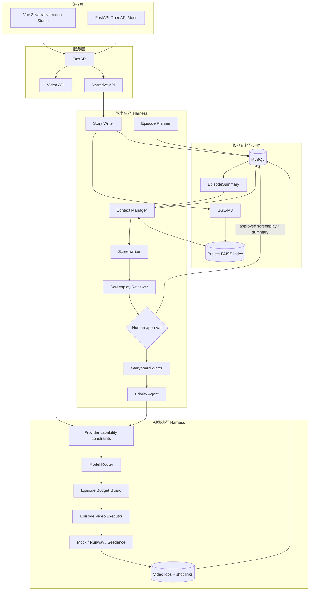
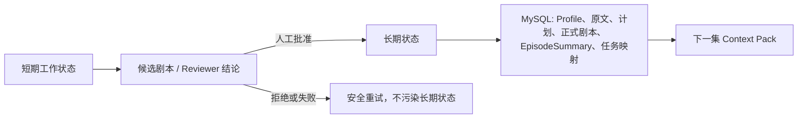

# ReelRouter v1 架构

## 设计目标

ReelRouter v1 的目标是把“长文本改编为分集 AI 视频”拆成可以验证、恢复和人工干预的阶段，而不是让一个 Prompt 覆盖全部过程。

## 状态与职责

| 组件 | 负责什么 | 不负责什么 |
| --- | --- | --- |
| Story Writer | 依据关键词生成结构化小说 | 直接选择视频模型或提交视频 |
| Context Manager | 从 Profile、原文、RAG 和上一集摘要组装受控上下文 | 创作新剧情 |
| Screenwriter | 把受控上下文写成候选剧本 | 自动发布剧本 |
| Reviewer | 给出通过/拒绝建议与跨集摘要 | 代替人做发布决定 |
| Human approval | 将通过的候选稿变成正式剧本与长期摘要 | 重写模型内容 |
| Storyboard Writer | 根据已批准剧本拆镜头 | 无视 Provider 的时长边界 |
| Model Router | 在可执行模型中选择满足质量门槛的低成本项 | 修改叙事内容 |
| Episode Video Executor | 预检整集预算、提交、恢复和轮询任务 | 伪造 Provider 输出 |

## 两类状态

关键原则：候选输出不是事实。只有 Reviewer 通过且人工批准后，`EpisodeSummary` 才进入下一集上下文。

## Provider 感知的分镜约束

视频 Provider 的最短和最长时长会在分镜生成阶段转换为 `StoryboardVideoConstraints`。这避免了先生成一个看似合理、却无法被当前模型执行的分镜。

例如当前 Seedance 2.x Profile 为 4–15 秒；ReelRouter 的单镜头上限保持 10 秒。因此 45 秒单集最多可有 `floor(45 / 4) = 11` 个镜头。若生成 12 个镜头，至少需要 48 秒，系统会在分镜阶段要求重写，而不是在付费视频提交后失败。

## 失败边界

| 失败 | 系统行为 |
| --- | --- |
| LLM 输出不符合 JSON / Schema | 反馈字段级错误，有限重试，候选/长期状态不写入。 |
| 第 2 集缺少上一集摘要 | 返回 409，前端锁定第 2 集的剧本生成。 |
| Provider 配置错误 | 返回 503，而非无信息 500。 |
| 单镜头不可执行 | 预检返回时长/模式约束错误，未提交任务。 |
| 整集超预算 | 提交前失败，保证不出现部分计费。 |
| Provider 部分提交失败 | 已提交镜头映射被保存；修复后可恢复，避免重复提交。 |
